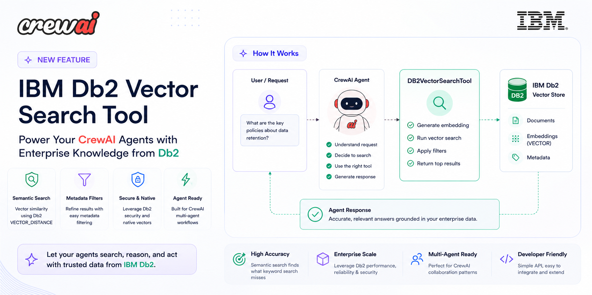

<p align="center">
  
</p>

<h1 align="center">Airline Delay Management Assistant</h1>

<p align="center">
  <strong>Production-grade multi-agent orchestration with CrewAI · Haystack · IBM Db2</strong>
</p>

<p align="center">
  
  
  
  
  
  
</p>

---

## Overview

This project is a reference implementation of **enterprise multi-agent AI orchestration**. When a flight delay is reported, a crew of **10 specialized AI agents** work together — in parallel and sequentially — to analyze weather conditions, flight status, passenger needs, aircraft readiness, runway availability, rebooking options, and compensation entitlements, before producing a single validated operational response.

Rather than a single LLM answering a question, every agent owns a specific domain. Agents share context, build on each other's outputs, and consult a shared enterprise knowledge base backed by **IBM Db2** — so they never hallucinate airline policies.

> **Example query:** `Flight AI302 from Delhi to London is delayed because of heavy rain. What should we do?`

---

## Agent Pipeline

```
User Request  ──►  FastAPI  ──►  SSE Stream  ──►  Web UI
                       │
                       ▼
             Operations Manager Agent
             (orchestrates full response plan)
                       │
          ┌────────────┼────────────┐
          ▼            ▼            ▼
    Weather Agent  Flight Agent  Passenger Agent     ← parallel
          │            │            │
          └─────┬───────┘     ┌─────┘
                ▼             ▼
          Runway Agent   Aircraft Agent   Rebooking Agent   ← sequential
                │             │               │
                └──────┬───────┘               │
                       ▼                       ▼
               Decision Agent  ──────►  Compensation Agent
                       │
                       ▼
                 Review Agent
                       │
                       ▼
              Final Validated Response
```

All 10 agents share the **IBM Db2 Search Tool** — a Haystack-backed semantic retrieval tool that queries 20 enterprise knowledge documents (SOPs, policies, regulations, manuals, FAQs) stored in IBM Db2.

---

## Technology Stack

| Layer             | Technology                                        |
|-------------------|---------------------------------------------------|
| Orchestration     | [CrewAI](https://github.com/crewAIInc/crewAI) 1.x |
| LLM               | [Ollama](https://ollama.ai) · `granite3.3:8b` (local) |
| Knowledge Store   | [Haystack](https://haystack.deepset.ai) 2.x + IBM Db2 |
| Embeddings        | `sentence-transformers/all-MiniLM-L6-v2` (384-dim) |
| Reranker          | `cross-encoder/ms-marco-MiniLM-L-6-v2`            |
| Vector Store      | IBM Db2 — `AIRLINE_KB.VECTORS`                    |
| Document Store    | IBM Db2 — `AIRLINE_KB.DOCUMENTS`                  |
| API Backend       | FastAPI with SSE streaming                        |
| UI                | Carbon Design System (served at `/`)              |
| Language          | Python 3.11+                                      |
| Config            | `pydantic-settings` + `.env`                      |
| Logging           | Python `logging` + `structlog`                    |

---

## Project Structure

```
CrewAI_IBM_Db2_Agents/
├── src/
│   ├── agents/           ← 10 CrewAI agents (one per domain)
│   ├── tasks/            ← 9 CrewAI tasks with context dependency chains
│   ├── tools/            ← db2_search_tool · weather_tool · flight_tool · airport_tool
│   ├── crew/             ← AirlineCrew — assembly, callbacks, SSE events, run()
│   ├── knowledge/        ← Haystack ingestion + retrieval pipelines + Db2 stores
│   ├── mock_services/    ← Realistic mock PSS, fleet, and booking services
│   ├── api/              ← FastAPI app, SSE routes, Pydantic schemas
│   ├── config/           ← pydantic-settings configuration class
│   ├── data/             ← 20 enterprise knowledge documents (markdown)
│   │   ├── sops/         ← Standard operating procedures (5 docs)
│   │   ├── policies/     ← Passenger rights, compensation, rebooking (5 docs)
│   │   ├── manuals/      ← Crew, ground, aircraft, airport ops (4 docs)
│   │   ├── regulations/  ← EU261/2004, DGCA, IATA delay codes (3 docs)
│   │   └── faqs/         ← Passenger, crew, operations FAQs (3 docs)
│   └── utils/            ← Structured logging with noise suppression
│
├── scripts/
│   └── ingest_knowledge.py   ← CLI — loads all 20 docs into IBM Db2
│
├── tests/
│   ├── test_knowledge/       ← Ingestion + retrieval pipeline tests
│   └── test_tools/           ← IBM Db2 Search Tool tests
│
├── static/
│   └── index.html            ← Carbon Design System web UI (served at /)
│
├── public/
│   └── cover.png             ← Project banner
│
├── plan/                     ← Design documents and collaboration guides
├── run_crew.py               ← CLI entry point
├── .env.example
└── requirements.txt
```

---

## Prerequisites

| Requirement         | Version  | Notes                                              |
|---------------------|----------|----------------------------------------------------|
| Python              | 3.11+    |                                                    |
| Ollama              | Latest   | [Download](https://ollama.ai) — runs LLM locally  |
| IBM Db2             | 11.5+    | Cloud Pak for Data or local instance               |
| OpenWeatherMap key  | Free     | [Sign up](https://openweathermap.org/api)          |
| AviationStack key   | Free     | [Sign up](https://aviationstack.com)               |

---

## Setup

### 1 · Clone and install

```bash
git clone git@github-ibm:PawanThakurIBM/CrewAI_IBM_Db2_Agents.git
cd CrewAI_IBM_Db2_Agents

python3.11 -m venv .venv
source .venv/bin/activate        # Windows: .venv\Scripts\activate

pip install -r requirements.txt
```

### 2 · Configure environment

```bash
cp .env.example .env
```

Open `.env` and fill in:

```env
# IBM Db2
DB2_HOST=
DB2_PORT=50000
DB2_DATABASE=BLUDB
DB2_USERNAME=
DB2_PASSWORD=

# External APIs
OPENWEATHER_API_KEY=
AVIATIONSTACK_API_KEY=
```

### 3 · Start Ollama and pull the model

```bash
ollama serve                     # start the local LLM server
ollama pull granite3.3:8b        # pull the Granite model (~5 GB)
```

### 4 · Create IBM Db2 schema

Connect to your Db2 instance and run:

```sql
CREATE SCHEMA AIRLINE_KB;

CREATE TABLE AIRLINE_KB.DOCUMENTS (
    id         VARCHAR(255) NOT NULL PRIMARY KEY,
    content    CLOB,
    meta       VARCHAR(4096),
    created_at TIMESTAMP DEFAULT CURRENT_TIMESTAMP
);

CREATE TABLE AIRLINE_KB.VECTORS (
    id         VARCHAR(255) NOT NULL PRIMARY KEY,
    doc_id     VARCHAR(255),
    embedding  VARCHAR(32000),
    meta       VARCHAR(4096),
    created_at TIMESTAMP DEFAULT CURRENT_TIMESTAMP
);
```

### 5 · Ingest the knowledge base

```bash
python scripts/ingest_knowledge.py
```

This processes all 20 documents into 57 chunks and stores them with embeddings in IBM Db2.

### 6 · Start the server

```bash
uvicorn src.api.main:app --reload --host 0.0.0.0 --port 8000
```

Open **http://127.0.0.1:8000** in your browser.

---

## Usage

### Web UI

Navigate to `http://127.0.0.1:8000` and submit a delay query. Agent steps animate in real time via Server-Sent Events.

### API — Streaming (SSE)

```bash
curl -N "http://127.0.0.1:8000/api/v1/analyze/stream?flight_query=Flight+AI302+from+Delhi+to+London+delayed+due+to+heavy+rain"
```

Each event is a JSON `AgentEvent`:

```json
{ "type": "agent_done", "agent": "Weather Agent", "step": 1, "output": "..." }
{ "type": "final", "output": "..." }
```

### API — Blocking

```bash
curl -X POST http://127.0.0.1:8000/api/v1/analyze \
  -H "Content-Type: application/json" \
  -d '{"flight_query": "Flight AI302 from Delhi to London is delayed due to heavy rain."}'
```

### CLI

```bash
python run_crew.py
```

---

## API Reference

| Method | Endpoint                     | Description                                    |
|--------|------------------------------|------------------------------------------------|
| `GET`  | `/`                          | Web UI (Carbon Design System)                  |
| `POST` | `/api/v1/analyze`            | Full crew run — returns when all agents finish |
| `GET`  | `/api/v1/analyze/stream`     | SSE stream — real-time agent events            |

---

## Environment Variables

| Variable                 | Description                             | Required |
|--------------------------|-----------------------------------------|----------|
| `DB2_HOST`               | IBM Db2 hostname                        | Yes      |
| `DB2_PORT`               | IBM Db2 port (default `50000`)          | Yes      |
| `DB2_DATABASE`           | Db2 database name                       | Yes      |
| `DB2_USERNAME`           | Db2 username                            | Yes      |
| `DB2_PASSWORD`           | Db2 password                            | Yes      |
| `OPENWEATHER_API_KEY`    | OpenWeatherMap API key                  | Yes      |
| `AVIATIONSTACK_API_KEY`  | AviationStack API key                   | Yes      |
| `SENDGRID_API_KEY`       | SendGrid key (optional notifications)   | No       |

---

## Knowledge Base

The enterprise knowledge base consists of **20 documents / 57 chunks** covering:

| Category      | Documents                                                           |
|---------------|---------------------------------------------------------------------|
| SOPs          | Flight delay, diversion, cancellation, ground stop, weather ops     |
| Policies      | Passenger rights, compensation, rebooking, refund, special assistance |
| Manuals       | Crew ops, ground ops, aircraft maintenance, airport ops             |
| Regulations   | EU 261/2004, DGCA passenger charter, IATA delay codes               |
| FAQs          | Passenger FAQ, crew FAQ, operations FAQ                             |

Agents query this knowledge base through the **IBM Db2 Search Tool**:

```
Agent  ──►  db2_search_tool._run(query)
                │
                ▼
         Haystack Retrieval Pipeline
         embed → AIRLINE_KB.VECTORS cosine search (top-10)
         → rerank (top-5) → AIRLINE_KB.DOCUMENTS
                │
                ▼
         Formatted string returned to agent
```

---

## Running Tests

```bash
# All tests
pytest

# Specific suites
pytest tests/test_knowledge/
pytest tests/test_tools/
```

---

## Work Division

| Area                              | Owner |
|-----------------------------------|-------|
| All 10 CrewAI agents              | Dhruv |
| All 9 CrewAI tasks                | Dhruv |
| Crew orchestration + SSE          | Dhruv |
| External API tools                | Dhruv |
| Mock enterprise services          | Dhruv |
| FastAPI backend + Web UI          | Dhruv |
| Enterprise knowledge dataset      | Pawan |
| Haystack ingestion pipeline       | Pawan |
| IBM Db2 Document + Vector Store   | Pawan |
| Haystack retrieval pipeline       | Pawan |
| IBM Db2 Search Tool               | Pawan |
| Tests                             | Both  |

---

## Integration Point

The single interface between both work streams is `src/tools/db2_search_tool.py`.

Dhruv's agents import and call it. Pawan's Haystack pipeline powers it internally.
The contract is simple: `_run(query: str) -> str` — always returns a plain string.

See [`plan/integration_guide.md`](plan/integration_guide.md) for the full contract specification.

---

## Documentation

| Document                                              | Contents                                         |
|-------------------------------------------------------|--------------------------------------------------|
| [`plan/context.md`](plan/context.md)                  | Full project overview and objectives             |
| [`plan/architecture.md`](plan/architecture.md)        | System architecture and folder structure         |
| [`plan/agents.md`](plan/agents.md)                    | All 10 agent specifications                      |
| [`plan/tasks.md`](plan/tasks.md)                      | Task breakdown — D1–D8 (Dhruv), P1–P7 (Pawan)   |
| [`plan/setup_guide.md`](plan/setup_guide.md)          | Detailed step-by-step setup guide                |
| [`plan/integration_guide.md`](plan/integration_guide.md) | Dhruv ↔ Pawan contracts and sync points       |
| [`plan/project_status.md`](plan/project_status.md)    | Current completion checklist                     |
| [`plan/pawan_context.md`](plan/pawan_context.md)      | Pawan's onboarding and owner document            |
| [`plan/knowledge_dataset.md`](plan/knowledge_dataset.md) | Per-document specs for the knowledge base     |
| [`plan/api_research.md`](plan/api_research.md)        | External API comparison and selection            |

---

<p align="center">Built with <strong>CrewAI</strong> · <strong>Haystack</strong> · <strong>IBM Db2</strong> · <strong>Ollama</strong></p>
